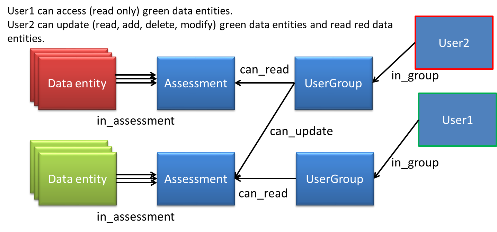

:orphan:

.. _rights_guide:

############################
The access rights management
############################

All entities that requires access rights management are linked to 
one 'Assessment' entity by the relation 'in_assessment'.
As the access rights are set on the 'Assessment' entity through the
'can_read' and 'can_update' relations, the concerned entity are accessible
only by authorized users. See schema below:

|

    Cube access rights management

.. automodule:: cubes.piws.schema.security
